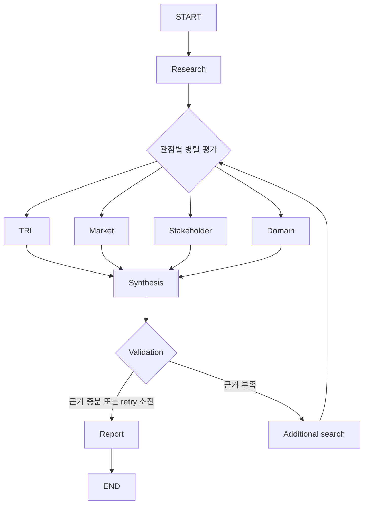

# SKALA Agent — KV Cache 기술 비교

## Subject

본 프로젝트는 KV cache 최적화 기술을 소프트웨어와 하드웨어 두 진영에서 선정해,
시장·이해관계자·도메인 관점에서 평가하는 Agentic RAG를 개발하는 프로젝트입니다.

## Overview

- Objective: 하나의 기술을 복수 관점에서 비교 평가
- Method: Multi-Agent(Distributed) + Agentic RAG
- Tools: LangGraph, Ollama, Tavily, BAAI/bge-m3

## Selected Technologies

- SW: TurboQuant — KV cache 양자화·압축 접근을 비교하기 위한 소프트웨어 대표 사례
- HW: ITME — 계층형 메모리 확장 접근을 비교하기 위한 하드웨어 대표 사례

## Features

- PDF 자료 기반 정보 추출과 기술별 근거 관리
- TRL·시장성·이해관계자·도메인 관점의 병렬 평가
- 부족한 근거의 선택적 재검색과 최대 2회 retry
- Evidence ID·기술 ID·URL·지지 여부를 확인하는 인용 검증
- 확증 편향 방지: URL 존재나 검색 성공만으로 주장을 확정하지 않고, 근거 연결과 지지 여부를 검증

## Tech Stack

- Framework: LangGraph
- LLM/Generator: DemoProvider 기반 offline 실행
- LLM/Judge: Evidence Validation Agent
- Retrieval: numpy VectorStore, Retriever — Hit@1, Hit@3, MRR
- Embedding: BAAI/bge-m3

## Agents

- Research Agent: 선택 기술의 기술 개요·범위·한계·실험 조건 수집
- TRL Agent: 기술 성숙도 평가
- Market Agent: 시장 규모·채택·생태계 평가
- Stakeholder Agent: GPU·메모리·클라우드·오픈소스·투자자 관점 평가
- Domain Agent: 데이터센터·클라우드 서빙 적용성 평가
- Synthesis Agent: 네 관점의 결과와 trade-off 종합
- Validation Agent: Evidence 연결과 주장 지지 여부 검증
- Report Agent: 검증된 판정과 인용으로 Markdown 보고서 생성

## Architecture



## Directory Structure

```text
├── data/                  # PDF·청크·벡터 문서 풀
├── src/skala_agent/
│   ├── agents/            # Agent 모듈
│   ├── prompts/           # 프롬프트 템플릿
│   ├── retrieval/         # PDF 처리·임베딩·검색
│   ├── workflow/          # LangGraph workflow
│   ├── providers.py       # Provider 계약과 DemoProvider
│   └── cli.py             # 실행 스크립트
├── outputs/               # 평가 결과 저장
├── tests/                 # 회귀 테스트
└── README.md
```

## Usage

```bash
make setup
make run
make test
make lint
```

## Contributors

- 김동찬: PDF Parsing, Retrieval, Embedding, VectorStore
- 김강휘: 평가 Agent, Prompt, 실제 provider
- 윤소영: Workflow, State, retry·오류 처리
- 이준형: Synthesis, Evidence Validation, Report/Citation, E2E 테스트·README
