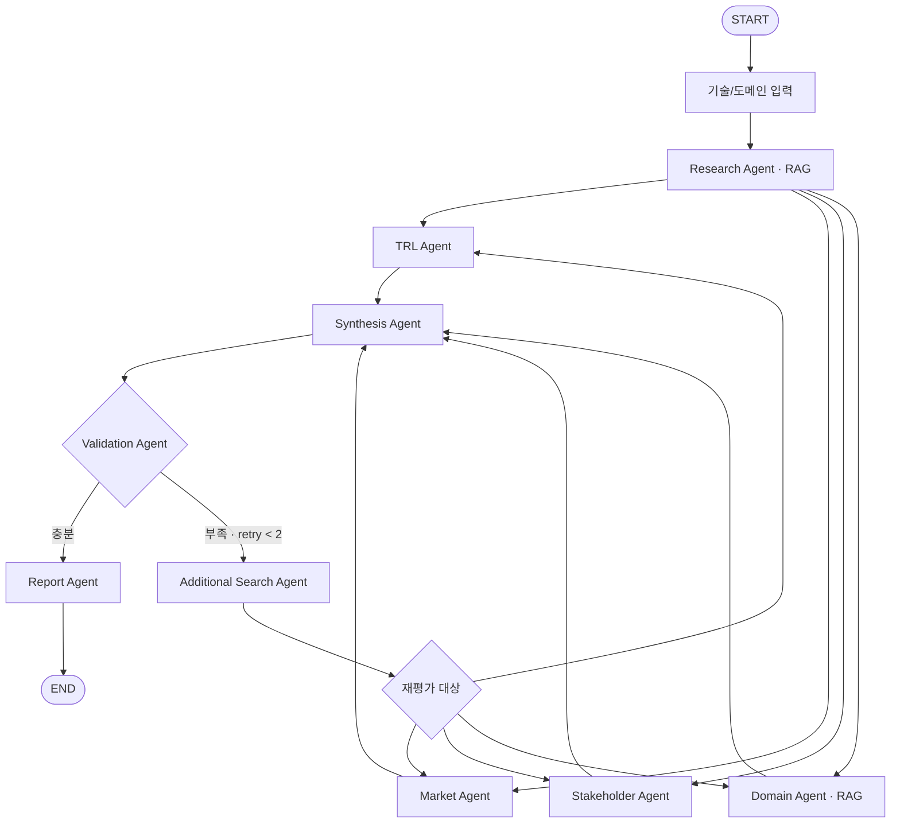

# SKALA Agent — KV Cache 기술 비교

## Subject

장문 LLM 추론에서 KV cache는 context length 증가에 따라 GPU HBM을 빠르게 소모합니다.

본 프로젝트는 이 메모리 병목을 해결하는 두 가지 상반된 접근을 선정하고, **데이터센터·클라우드 서빙 환경에서 기술 성숙도·시장성·이해관계자·도메인 적용성을 근거 기반으로 비교 평가하는 Agentic RAG 시스템**을 구현합니다.

* **SW:** TurboQuant — KV cache 자체를 압축
* **HW:** ITME — 메모리 계층을 확장

목표는 특정 기술의 우열을 결정하는 것이 아니라, **각 접근의 적용 조건과 trade-off를 명확하게 드러내는 것**입니다.

---

## Overview

* **Objective:** KV cache 최적화 기술을 복수 관점에서 중립적으로 비교 평가
* **Domain:** 데이터센터 · 클라우드 LLM Serving
* **Method:** Multi-Agent + Agentic RAG
* **Framework:** LangGraph
* **Local LLM:** Qwen3-4B / Ollama
* **Web Search:** Tavily
* **Embedding:** BAAI/bge-m3

### 핵심 Workflow

```text
기술 원문 조사
      ↓
┌─────┬─────┬─────┬─────┐
TRL   시장성  이해관계자  도메인
└─────┴─────┴─────┴─────┘
      ↓
   관점 종합
      ↓
   근거 검증
   ↙       ↘
부족        충분
 ↓           ↓
재검색      보고서 생성
 ↓
해당 Agent 재평가
```

---

## Selected Technologies

| 구분 | 기술             | 접근                            |
| -- | -------------- | ----------------------------- |
| SW | **TurboQuant** | KV cache를 저비트 양자화해 저장량 감소     |
| HW | **ITME**       | CXL 기반 계층형 메모리 확장으로 KV 수용량 증가 |

두 기술은 동일한 KV cache 병목을 해결하지만 접근이 정반대입니다.

```text
TurboQuant
→ 데이터를 작게 만든다
→ 정확도 / 압축률 trade-off

ITME
→ 저장 공간을 넓힌다
→ 성능 / 인프라 비용 trade-off
```

비교 대상은 Agent가 아닌 **Human 기반으로 선정**했습니다.
접근의 대립성, 적용 전제, 검증 주기의 차이를 기준으로 선정하여 이후 다관점 평가에 분석의 초점을 맞췄습니다.

---

## Key Features

* 논문 PDF 기반 **RAG 기술 조사**
* TRL·시장성·이해관계자·도메인 **4개 관점 병렬 평가**
* 각 주장과 출처를 연결하는 **Evidence 관리**
* 근거 부족 시 해당 항목만 **선택적 재검색**
* 재검색 후 관련 평가 Agent를 다시 실행하는 **Retry Loop**
* 관점 간 일치점뿐 아니라 **상충점과 Trade-off 탐지**
* 근거가 부족한 경우 결론을 생성하지 않고 **판단 보류**
* 한국어 질의 → 영어 논문 검색을 위한 **Cross-lingual Retrieval**

### 차별점

> **Agent의 첫 판단을 그대로 사용하지 않고, 근거를 검증한 뒤 부족한 관점만 다시 조사·평가한다.**

---

## Agents

| Agent                 | 역할                             |
| --------------------- | ------------------------------ |
| **Research**          | 논문에서 기술 원리·성능·한계·실험 조건 추출      |
| **TRL**               | 공개 근거를 TRL 1~9 기준에 매핑          |
| **Market**            | 시장 수요·채택·생태계 평가                |
| **Stakeholder**       | GPU·메모리·클라우드·개발자·투자자 관점 분석     |
| **Domain**            | 데이터센터의 비용·SLA·운영 적합성 평가        |
| **Synthesis**         | 4개 관점의 공통점·상충점·trade-off 종합    |
| **Validation**        | 주장과 Evidence의 대응 및 근거 부족 여부 검사 |
| **Additional Search** | 부족한 근거만 추가 검색 후 재평가 대상으로 전달    |
| **Report**            | 검증된 State를 기반으로 최종 평가 보고서 생성   |

---

## Agent Model Strategy

단순 추출·분류에는 로컬 경량 모델을 사용하고, 복잡한 종합 추론에는 더 강한 모델을 배치했습니다.

| Agent             | Model             | 이유                             |
| ----------------- | ----------------- | ------------------------------ |
| Research          | Qwen3-4B / Ollama | RAG 결과 구조화·정보 추출               |
| TRL               | Qwen3-4B / Ollama | 명시된 TRL 기준에 근거 매핑              |
| Market            | Qwen3-4B / Ollama | 검색 결과를 평가축에 분류                 |
| Stakeholder       | Qwen3-4B / Ollama | 주체별 입장 구조화                     |
| Domain            | Qwen3-4B / Ollama | 정해진 비용·SLA·운영 기준 평가            |
| Additional Search | Qwen3-4B / Ollama | 검색 질의 생성 및 결과 전달               |
| **Synthesis**     | **GPT-5.6 Sol**   | 관점 간 상충·trade-off를 종합하는 고난도 추론 |
| Validation        | GPT-5.6 Terra     | 주장과 Evidence 대응 관계 검증          |
| Report            | GPT-5.6 Terra     | 검증된 결과의 장문 보고서 구조화             |

> 반복 호출이 많은 조사·평가 단계는 로컬 모델로 비용과 외부 의존성을 줄이고, 복합 추론이 필요한 단계에만 상위 모델을 집중 배치했습니다.

---

## RAG

### Documents

* TurboQuant 원 논문
* TurboQuant 독립 분석 자료
* ITME 원 논문

각 chunk에는 다음 metadata를 저장합니다.

```text
paper_id
camp
role
section
```

### Embedding Selection

후보:

* BAAI/bge-m3
* Qwen3-Embedding-0.6B
* multilingual-e5-large
* gte-multilingual-base

50개 기술 질의로 직접 평가했습니다.

| Model                 |   Hit@1 |   Hit@3 |        MRR |
| --------------------- | ------: | ------: | ---------: |
| **BGE-M3**            | **46%** | **74%** | **0.6127** |
| Qwen3-Embedding-0.6B  |     38% |     68% |     0.5513 |
| multilingual-e5-large |     32% |     58% |     0.5057 |
| gte-multilingual-base |     32% |     56% |     0.4894 |

따라서 **BGE-M3**를 최종 Embedding 모델로 선정했습니다.

---

## Architecture



핵심은:

> **병렬 평가 → 종합 → 근거 검증 → 부족한 관점만 재검색·재평가 → 보고서 생성**

입니다.

---

## State Design

Agent는 직접 결과를 주고받는 대신 공통 State를 통해 구조화된 데이터를 전달합니다.

```text
tech_analysis
trl_analysis
market_analysis
stakeholder_analysis
domain_analysis
evidence
missing_evidence
synthesis
report
```

관점별 State key를 분리해 병렬 실행 시 충돌을 방지하고, `evidence`는 Reducer를 통해 누적합니다.

---

## Directory Structure

```text
├── data/                  # PDF·청크·벡터 문서 풀
├── src/skala_agent/
│   ├── agents/            # Agent
│   ├── prompts/           # Prompt
│   ├── retrieval/         # PDF / Embedding / Retrieval
│   ├── workflow/          # LangGraph
│   ├── providers.py       # LLM / Search Provider
│   └── cli.py             # 실행 Entry Point
├── outputs/               # 최종 보고서
├── tests/                 # 테스트
└── README.md
```

---

## Usage

```bash
make setup
make run
make test
make lint
```

필요한 외부 API Key는 `.env`로 관리하며 Repository에는 포함하지 않습니다.

로컬 Agent는 Ollama를 통해 실행합니다.

---

## Contributors

* **김동찬** — PDF Parsing, Chunking, Embedding, VectorStore, Retrieval
* **김강휘** — TRL·Market·Stakeholder·Domain Agent, Prompt, Structured Output
* **윤소영** — State, LangGraph Workflow, Fan-out/Fan-in, Retry Routing
* **이준형** — Synthesis, Evidence Validation, Report/Citation, E2E Test, README

---

이 네 개가 발표의 중심이고, `Directory Structure`, 세부 Usage 같은 건 **“구현도 되어 있다”는 증빙용으로 화면에만 보여주고 넘어가면 돼.**
