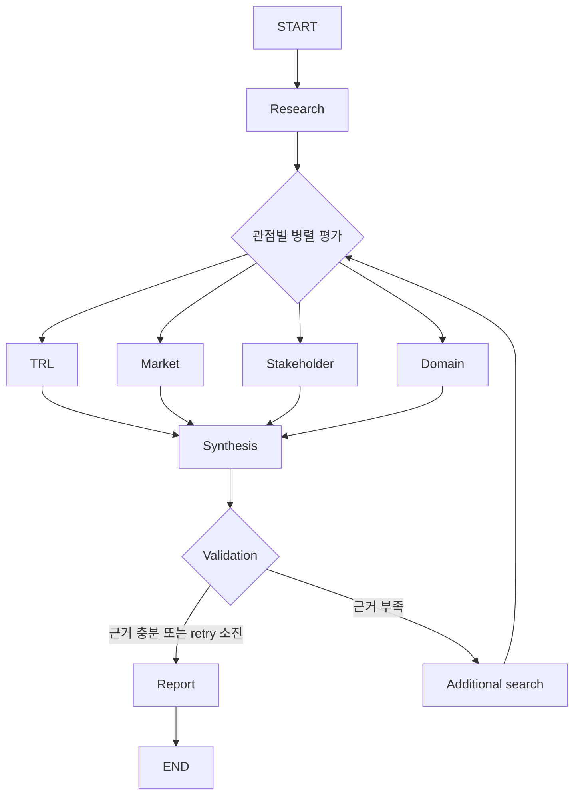

# SKALA Agent — KV Cache 기술 비교

## Subject

본 프로젝트는 KV cache 최적화 기술을 소프트웨어와 하드웨어 두 진영에서 선정해,
시장·이해관계자·도메인 관점에서 평가하는 Agentic RAG를 개발하는 프로젝트입니다.
장문 LLM 추론에서 커지는 KV cache 메모리 병목에 대해, 서로 다른 최적화 경로의
도입 조건과 trade-off를 근거 기반으로 비교합니다.

LLM은 이전 토큰의 Key-Value를 재사용해 연산을 줄이지만, 문맥 길이에 비례해 KV cache가
증가하면서 GPU HBM 용량을 빠르게 소진할 수 있습니다. 본 프로젝트는 이 연산 절감과 메모리
제약의 상충을 데이터센터·클라우드 서빙 환경에서 다룹니다.

## Overview

- Objective: 하나의 기술을 복수 관점에서 비교 평가하고 기술 도입 판단을 지원
- Method: Multi-Agent(Distributed) + Agentic RAG
- Tools: LangGraph, Ollama, Tavily, BAAI/bge-m3

## Selected Technologies

- SW: TurboQuant — KV cache 양자화·압축으로 저장량을 줄이는 소프트웨어 대표 사례
- HW: ITME — 계층형 메모리 확장으로 수용량을 높이는 하드웨어 대표 사례

두 기술은 같은 KV cache 병목을 다루지만, 모델 품질·지연 시간·인프라 비용·도입 주체의
trade-off가 달라 동일한 평가 프레임에서 비교합니다.

비교 대상은 에이전트가 임의로 고르지 않고 사람이 선정했습니다. 접근의 대립성, 적용 전제의
비대칭, 검증 주기 차이를 먼저 명시해 선정 과정의 재현성을 확보하고, 선정 이후의 다층 비교에
분석의 초점을 둡니다.

## Features

- PDF 자료 기반 정보 추출과 기술별 근거 관리
- TRL·시장성·이해관계자·도메인 관점의 병렬 평가
- 부족한 근거의 선택적 재검색과 최대 2회 retry
- Evidence ID·기술 ID·URL·지지 여부를 확인하는 인용 검증
- 확증 편향 방지: URL 존재나 검색 성공만으로 주장을 확정하지 않고, 근거 연결과 지지 여부를 검증
- 결론뿐 아니라 주장별 근거·인용·반대 trade-off를 함께 제시해 기술 도입 판단을 지원
- 검증 가능한 출처가 부족하면 결론을 꾸며내지 않고 `판단 보류`와 한계점으로 기록
- 한국어 질의와 영어 논문 원문 사이의 검색을 고려한 cross-lingual RAG 구성

## Tech Stack

- Framework: LangGraph
- Retrieval: numpy VectorStore, Retriever — Hit@1, Hit@3, MRR
- Embedding: BAAI/bge-m3 — 한국어 질의와 영어 기술 문서 검색을 고려한 다국어 임베딩

발표·설계 기준의 Agent별 모델 배정은 다음과 같습니다. 아직 정하지 않은 Agent는 공란으로 둡니다.

| Agent | 모델 배정 |
| --- | --- |
| Synthesis | `gpt-5.6-sol`, reasoning effort `medium` |
| Validation | `gpt-5.6-terra`, reasoning effort `low` |
| Report | `gpt-5.6-terra`, reasoning effort `low` |
| Research | |
| Additional Search | |
| TRL | |
| Market | |
| Stakeholder | |
| Domain | |

## Agents

- Research Agent: 선택 기술의 기술 개요·범위·한계·실험 조건 수집
- TRL Agent: 기술 성숙도 평가
- Market Agent: 시장 규모·채택·생태계 평가
- Stakeholder Agent: GPU·메모리·클라우드·오픈소스·투자자 관점 평가
- Domain Agent: 데이터센터·클라우드 서빙 적용성 평가
- Synthesis Agent: 네 관점의 결과와 trade-off 종합
- Validation Agent: Evidence 연결과 주장 지지 여부 검증
- Report Agent: 검증된 판정과 인용으로 Markdown 보고서 생성

Synthesis·Validation·Report Agent는 새 검색이나 모델 호출 대신 누적된 State만 사용합니다.
따라서 최종 결론은 앞 단계에서 수집·검증된 근거와 분리되지 않으며, 부족한 근거는 필요한
관점에 한해 재검색 흐름으로 되돌립니다.

## Architecture



핵심 흐름은 **병렬 평가 → 근거 검증 → 부족한 근거만 재검색 → 보고서 생성**입니다.
따라서 에이전트의 첫 판단을 그대로 채택하지 않고, 검증 가능한 근거가 연결된 판단만 최종 보고서에 반영합니다.

## Directory Structure

```text
├── data/                  # PDF·청크·벡터 문서 풀
├── src/skala_agent/
│   ├── agents/            # Agent 모듈
│   ├── prompts/           # 프롬프트 템플릿
│   ├── retrieval/         # PDF 처리·임베딩·검색
│   ├── workflow/          # LangGraph workflow
│   ├── providers.py       # Provider 계약과 DemoProvider
│   └── cli.py             # 실행 스크립트
├── outputs/               # 평가 결과 저장
├── tests/                 # 회귀 테스트
└── README.md
```

## Usage

```bash
make setup
make run
make test
make lint
```

## Contributors

- 김동찬: PDF Parsing, Retrieval, Embedding, VectorStore
- 김강휘: 평가 Agent, Prompt, 실제 provider
- 윤소영: Workflow, State, retry·오류 처리
- 이준형: Synthesis, Evidence Validation, Report/Citation, E2E 테스트·README
