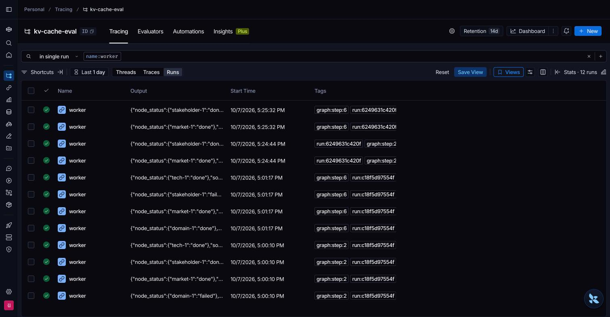
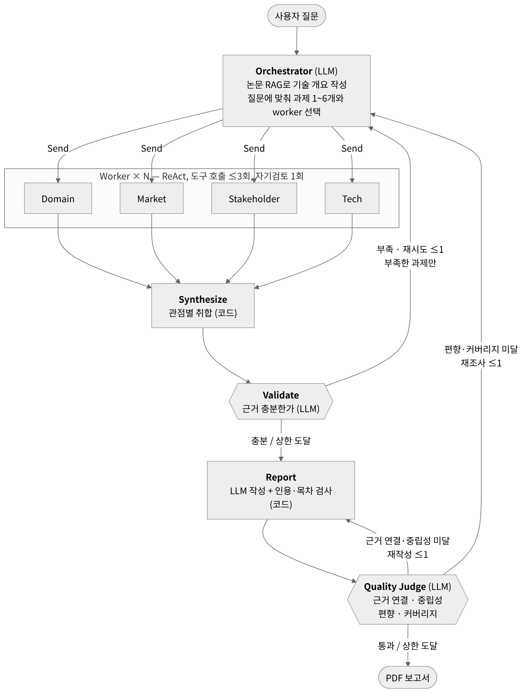

# KV Cache 기술 비교 에이전트

## Subject

본 프로젝트는 KV cache 최적화 기술을 소프트웨어, 하드웨어 두 진영에서 하나씩 선정하여,
기술 성숙도·시장성·이해관계자·도메인 관점에서 평가하는 Orchestrator-Workers 패턴 기반으로 설계·개발한 프로젝트입니다.

장문 LLM 추론에서는 context가 길어질수록 KV cache가 GPU 메모리(HBM)를 빠르게 차지합니다.
이 병목을 두고 "데이터를 줄이는" 접근과 "공간을 늘리는" 접근을 나란히 놓고,
어느 쪽이 낫다는 결론 대신 **어떤 조건에서 어떤 trade-off가 생기는지**를 근거와 함께 정리합니다.

## Overview

- **Objective** : 하나의 병목을 푸는 두 기술을 데이터센터·클라우드 LLM 서빙 관점에서 복수 관점으로 비교 평가
- **Pattern** : Orchestrator-Workers.
  질문마다 필요한 관점이 다르고, 관점별 조사는 서로 독립이라 병렬로 돌릴 수 있습니다.
  처음에는 4개 관점을 항상 모두 돌리는 고정 fan-out이었습니다. 그런데 질문과 무관한 관점까지 조사하느라 비용이 들고 스키마도 계속 커져서, 계획을 세우는 역할을 따로 떼어 오케스트레이터로 만들었습니다.
- **동적 처리** : 순서가 고정된 파이프라인과 세 군데가 다릅니다.
  1. 오케스트레이터가 질문을 읽고 과제 수(1~6개)와 맡길 worker를 고릅니다.
  2. 검증이 부족하다고 판정한 과제만 다시 실행합니다.
  3. 품질 평가에서 미달한 항목에 따라 재조사나 재작성으로 갈라집니다.

  아래는 같은 코드에 질문만 바꿔 실행한 LangSmith 기록입니다.
  넓은 질문("데이터센터 도입 관점 비교")에서는 worker 4개, 좁은 질문("투자자·클라우드 사업자 관점의 시장 채택 가능성만")에서는 2개가 같은 단계(`graph:step`)에서 동시에 시작했습니다.

  

## Selected Technologies

| 구분 | 기술 | 접근 | 선정 이유 |
| --- | --- | --- | --- |
| SW | **TurboQuant** | KV cache를 저비트로 양자화해 저장량을 줄임 | 하드웨어 변경 없이 서빙 소프트웨어만 바꿔 적용할 수 있어, 도입은 쉽지만 정확도 손실 위험을 떠안는 쪽의 대표 사례 |
| HW | **ITME** | CXL 기반 계층형 메모리로 KV cache 수용량을 늘림 | 원본을 그대로 두므로 정확도 손실은 없지만, CXL 인프라가 먼저 깔려 있어야 하는 쪽의 대표 사례 |

비교 대상은 에이전트가 아니라 팀이 직접 골랐습니다. 접근 방향이 정반대인지, 적용 전제가 다른지, 검증 단계가 다른지(SW는 오픈소스 구현이 빠르게 나오고 HW는 프로토타입 단계)를 기준으로 삼았습니다.
대상 선정까지 에이전트에게 맡기면 무엇을 비교할지부터 흔들려, 평가의 초점을 관점별 분석에 두기 어렵다고 판단했습니다.

## Features

- **PDF 자료 기반 정보 추출** : 원 논문 2편과 독립 분석 1편을 섹션 단위로 청킹하고, 청크마다 `paper_id`·`camp`·`role`·`section`을 붙여 색인합니다. 오케스트레이터는 각 기술의 primary 논문에서 원리·실험 조건·한계를 먼저 읽고 계획을 세웁니다.
- **웹 검색과 논문 검색을 worker가 선택** : worker는 ReAct 에이전트로, `web_search`(Tavily)와 `paper_search`(bge-m3 색인) 중 필요한 도구를 고릅니다. 호출은 최대 3회로 제한합니다.
- **원문 대조 인용** : 모든 근거는 `{claim, source_id, quote}` 형태이고, quote가 도구가 실제로 가져온 원문에 글자 그대로 있어야 인정합니다. 의역하거나 지어낸 인용은 코드가 제거합니다.
- **확증 편향 방지 전략**
  - 두 기술을 같은 지시, 같은 관점으로 조사합니다.
  - 보고서 프롬프트에서 "추천·우월·선택해야 한다" 같은 판정 표현을 금지하고, 조건별 trade-off로 쓰게 합니다.
  - 품질 평가에 편향 항목을 두었습니다. 단일 출처에 기대거나 한쪽에 유리한 근거만 모았으면 재조사로 돌려보내고, 이미 쓴 출처와 다른 출처에서 두 기술의 유리한 근거와 불리한 근거를 함께 찾게 합니다.
  - 근거가 없는 관점은 빼지 않고 "판단 보류"로 사유와 함께 남깁니다.
- **보고서 품질 평가** : 완성된 보고서를 LLM judge가 근거 연결·중립성·편향 통제·관점 커버리지 4개 항목으로 판정합니다.
  - 근거 연결·중립성처럼 서술에 문제가 있으면 보고서를 다시 씁니다.
  - 편향·커버리지처럼 근거에 문제가 있으면 오케스트레이터가 다시 조사합니다.
  - 재작성과 재조사는 각각 1회까지이고, 끝까지 미달이면 보고서 한계점에 항목과 사유를 적습니다.
- **중단 후 재개** : SQLite 체크포인트로 `--resume <run_id>` 하면 멈춘 노드부터 이어서 실행합니다. 끝난 worker는 다시 돌지 않습니다.
- **PDF 보고서** : 8개 목차(SUMMARY ~ REFERENCE) 보고서를 한글 글꼴을 포함한 PDF로 저장합니다. REFERENCE는 본문에 실제로 인용된 출처만으로 코드가 만듭니다.

## Tech Stack

| 구분 | 사용 |
| --- | --- |
| Framework | LangGraph (StateGraph, `Send`, SQLite Checkpointer), LangChain `create_agent` |
| LLM / Generator | GPT-5.4 mini (Responses API), 역할별 reasoning effort: 오케스트레이터 high, worker·검증·보고서 medium, 자기검토 low |
| LLM / Judge | GPT-5.4 mini, reasoning effort medium, 별도 프롬프트 |
| Retrieval | NumPy 전수 비교 벡터 스토어(코사인). 한국어 질의 20문항 기준 Hit@1 0.750 · Hit@3 0.900 · MRR 0.838 |
| Embedding | BAAI/bge-m3 (오픈소스, dense) |
| Web Search | Tavily |
| Observability | LangSmith (`run_id`를 metadata·tag로 연결) |
| Output | reportlab (Markdown → PDF) |

청크가 69개뿐이라 근사 색인 대신 전수 비교를 썼습니다. 이렇게 하면 검색 성능 측정에 색인 구조의 오차가 섞이지 않고, 임베딩 품질만 반영됩니다.

임베딩은 후보 4종을 기술 질의 50문항으로 먼저 비교해 골랐습니다.

| Model | Hit@1 | Hit@3 | MRR |
| --- | ---: | ---: | ---: |
| **BAAI/bge-m3** | **46%** | **74%** | **0.6127** |
| Qwen3-Embedding-0.6B | 38% | 68% | 0.5513 |
| multilingual-e5-large | 32% | 58% | 0.5057 |
| gte-multilingual-base | 32% | 56% | 0.4894 |

위 표는 모델을 고르기 위한 비교입니다. Retrieval 행의 수치는 고른 모델로 만든 파이프라인을 정답 청크 라벨링 질의로 다시 잰 값이라, 두 숫자를 섞어 읽으면 안 됩니다. 평가셋과 재현 방법은 [`docs/issue-4-retrieval-evaluation.md`](docs/issue-4-retrieval-evaluation.md)에 있습니다.

## Agents

| Agent | 하는 일 | 판정 주체 |
| --- | --- | --- |
| **Orchestrator** | 논문 발췌로 기술 개요를 쓰고, 질문에 필요한 과제와 worker를 정함. 재시도·재조사 때는 해당 과제만 다시 지시하고, 재조사 때는 빠진 관점의 과제를 추가할 수 있음 | LLM (규칙 위반 시 코드가 1회 재요청 후 기본 계획으로 대체) |
| **Domain worker** | 데이터센터 비용, SLA(TTFT/TPOT, 정확도), 운영 적합성 | LLM + 인용 검사(코드) |
| **Market worker** | 수요, 채택 사례, 생태계와 의존성 | LLM + 인용 검사(코드) |
| **Stakeholder worker** | GPU·메모리 벤더, 클라우드, 오픈소스, 투자자의 입장 | LLM + 인용 검사(코드) |
| **Tech worker** | 기술 원리, 실험 근거, 한계, 성숙도(TRL) | LLM + 인용 검사(코드) |
| **Synthesizer** | worker 결과를 관점별로 묶음 | 코드 |
| **Validator** | 질문에 답할 만큼 근거가 모였는지 판정하고, 부족한 과제에 보완점을 지시 | LLM (재시도 상한은 코드) |
| **Reporter** | 8개 목차 보고서 작성 | LLM (목차·인용 형식은 코드가 검사, 2회 실패 시 템플릿 보고서) |
| **Quality Judge** | 4개 품질 항목 판정 | LLM (어디로 돌려보낼지는 코드) |

worker 한 번의 흐름은 다음과 같습니다.

```text
검색(최대 3회) → 원문에 없는 인용 제거 → 자기검토 1회 → 다시 인용 검사
```

## State Schema

공유 State는 키 17개입니다. 노드는 바뀐 키만 반환합니다. 전체 계약은 [`docs/interfaces.md`](docs/interfaces.md)에 있습니다.

```text
제어   run_id · plan · to_run · verdict · retry_count · quality · rewrite_count · research_count
페이로드 question · tech_brief · worker_results · sources · result · cited_ids · report
운영   node_status · last_error
```

- **제어 vs 페이로드 분리**
  - 분기와 상한 판단은 제어 키만 보고 합니다. 예를 들어 `route_after_validate`는 `verdict`와 `retry_count`만, `judge_action`은 미달 항목과 두 카운터만 읽습니다.
  - 무엇을 실행할지는 `to_run`에 명시하고, `dispatch`는 그 목록만 `Send`합니다.
  - 근거 본문은 페이로드에만 둡니다. 덕분에 경로 규칙은 LLM 없이 단위 테스트로 검증할 수 있습니다.
- **관측성 위치**
  - State 안에는 `node_status`(노드·과제별 pending/done/failed/fallback)만 둡니다.
  - 상세 흐름은 LangSmith에 맡겼습니다. 각 실행에는 `run_id` metadata와 `run:<id>` tag가 붙고, 병렬 실행 여부는 LangGraph가 남기는 `graph:step` tag로 확인합니다.
- **지속성 비용**
  - 체크포인트는 superstep마다 State 전체를 SQLite에 저장합니다.
  - 그래서 `sources`에는 finding이 실제로 인용한 원문만 남기고, 원문도 1,200자로 자릅니다.
  - 역직렬화는 허용 목록에 있는 타입만 받습니다.
- **상관**
  - `run_id` 하나가 체크포인트 thread_id, LangSmith metadata, 보고서 파일명(`report-{run_id}.pdf`)을 겸합니다.
  - 출처 id는 `{task_id}-w1`·`{task_id}-p2` 형식이라, 인용 하나를 보고 어느 과제가 어떤 도구로 가져왔는지 거꾸로 찾을 수 있습니다.
- **재개/복구**
  - worker 안의 오류(타임아웃, 스키마 위반 등)는 그 과제만 `success=False`로 기록하고 실행은 계속합니다.
  - 그 밖의 노드에서 실행이 멈추면 CLI가 `last_error`를 체크포인트에 남기고 `--resume` 명령을 안내합니다.
  - judge 호출이 실패하면 통과로 처리하고, 그 사실을 한계점에 적습니다.
- **동시 처리**
  - 병렬 worker는 `worker_results[task_id]`, `sources[source_id]`처럼 자기 키에만 씁니다.
  - dict 병합 Reducer로 합치므로 같은 superstep에서 써도 서로 덮지 않습니다.
- **종료 보장**
  - 상한은 모두 코드에 있습니다: 과제 1~6개, worker당 도구 3회, 검증 재시도 1회, 재작성 1회, 재조사 1회.
  - 재조사 뒤에는 검증이 판정만 하고 다시 돌리지 않습니다.
  - 이 상한들로 가능한 가장 긴 경로가 18 superstep이고, `recursion_limit=25`가 마지막 안전장치입니다.

## Architecture



그림의 원본은 [`docs/images/architecture.mmd`](docs/images/architecture.mmd)입니다.

판정(근거가 충분한가, 보고서가 중립적인가)은 LLM이 합니다. 몇 번까지 돌지, 어디로 돌아갈지는 `checks.py`의 순수 함수가 정합니다.
그래프의 모든 되돌아가는 화살표에는 코드로 정한 횟수 상한이 붙어 있습니다.

## Design Decisions

설계하면서 실제로 고민했고, 방향을 바꾼 지점들입니다.

**고정 fan-out에서 오케스트레이터로.**
첫 버전은 매번 4개 관점을 모두 돌리고 Assessment·Signal·관점별 Details 같은 스키마로 결과를 받았습니다. 관점이 늘 때마다 스키마가 커졌고, "투자자 관점만" 같은 질문에도 기술평가까지 돌았습니다.
기술평가 에이전트를 오케스트레이터로 올리고, worker 출력은 `finding + source` 하나로 줄였습니다. State 키는 이전 버전보다 단순해졌고, 질문에 따라 실제로 다른 계획이 나옵니다(위 Overview의 4개 대 2개).

**판정은 LLM, 경계는 코드.**
LLM에게 "과제는 6개 이하로", "재시도는 한 번만"이라고 프롬프트로 부탁하는 대신, 규칙을 코드로 검사합니다.
- 계획이 규칙을 어기면 위반 내용을 알려 1회 다시 묻고, 그래도 어기면 기본 계획을 씁니다.
- 인용은 원문 부분문자열인지 검사합니다.
- 재시도 경로는 LLM의 판정 결과를 입력으로 받아 코드가 고릅니다.

**종합은 LLM을 쓰지 않는다.**
worker 결과를 관점별로 묶는 일은 요약이 아니라 정리입니다. 여기에 LLM을 넣으면 근거가 한 번 더 바뀌어 쓰일 수 있어서 코드로만 처리했습니다.

**품질 미달은 원인에 따라 다른 곳으로 보낸다.**
"중립성 미달"은 문장을 고치면 되지만, "편향 미달"은 근거 자체가 한쪽에 몰린 것이라 다시 써도 해결되지 않습니다.
그래서 미달 항목별로 재작성과 재조사를 나눴고, 둘 다 미달이면 재조사를 먼저 합니다. 재조사 뒤에는 보고서를 어차피 새로 쓰기 때문입니다.

**동작은 실제 API로 검증한다.**
처음에는 가짜 응답으로 테스트를 짰는데, 실제 API에서만 드러나는 문제가 두 번 나왔습니다.
- gpt-5 계열이 Chat Completions에서 도구 호출과 reasoning effort를 함께 받지 않아, worker가 전부 400 오류로 실패했습니다.
- 그런데 live 테스트는 템플릿 보고서가 나온다는 이유로 통과하고 있었습니다.

지금은 LLM이 없는 순수 규칙만 단위 테스트로 두고, 워크플로 동작은 "worker가 실제로 근거를 모았는가"까지 확인하는 live 테스트로 검증합니다. CI도 저장소 시크릿으로 실제 API를 호출합니다.

**측정 결과가 가정을 뒤집었다.**
참고문헌 청크를 검색에서 빼면 정확도가 오를 거라 보고 제외 기능을 만들었는데, 실제로 재보니 Hit@3가 0.900에서 0.850으로 떨어졌습니다.
청킹이 페이지 단위라 그래프와 참고문헌이 같이 있는 페이지가 통째로 제외됐기 때문입니다. 참고문헌 표시는 메타데이터로만 남기고 검색에서는 거르지 않습니다.

**남은 과제.**
- worker의 재시도 결과가 이전보다 나빠도 덮어씁니다. 실제로 근거 7건이던 과제가 재시도에서 0건이 된 적이 있습니다.
- judge가 보고서 작성 모델과 같은 모델이라, 자기 글에 관대할 가능성을 배제하지 못했습니다.
- "KV, KQV, QKQV"처럼 한두 글자만 다른 약어는 dense 임베딩만으로 구분하지 못해, 키워드 검색 보완이 필요합니다.

## Directory Structure

```text
├── app.py                 # 실행 스크립트 (skala_agent.cli 진입점)
├── configs/               # 논문 목록 (URL, sha256)
├── data/                  # 문서 풀 (PDF는 커밋하지 않음)
├── index/                 # bge-m3 색인 (커밋하지 않음)
├── evals/                 # 검색 평가셋과 결과
├── docs/                  # 설계 문서, State 계약, 그림
├── src/skala_agent/
│   ├── agents/            # orchestrator · worker · synthesizer · validator · reporter · judge
│   ├── prompts/           # 프롬프트 템플릿
│   ├── retrieval/         # PDF 파싱 · 청킹 · 임베딩 · 벡터 스토어 · 검색
│   ├── workflow/          # State 정의와 LangGraph 그래프
│   ├── checks.py          # 계획·인용·보고서·분기 규칙 (LLM 없음)
│   ├── tools.py           # web_search · paper_search
│   ├── pdf.py             # 보고서 PDF 출력
│   └── cli.py             # 실행, 재개, 체크포인트
├── outputs/               # report-{run_id}.pdf, checkpoints.sqlite
├── tests/                 # 규칙 단위 테스트 + live 테스트
└── README.md
```

## Usage

```bash
make setup                                   # 의존성 설치 (uv)
make run                                     # 기본 질문으로 보고서 생성
python app.py --question "투자자 관점에서 시장 채택 가능성만 비교해줘"
python app.py --resume <run_id>              # 중단된 실행 이어서

make test-unit                               # 규칙 테스트 (외부 호출 없음)
make test                                    # 규칙 + live 테스트
```

접속 정보는 `.env`에 두고 저장소에는 올리지 않습니다. 항목은 `.env.example`에 있습니다.
논문 검색을 쓰려면 `uv sync --extra embedding`으로 임베딩 모델을 설치한 뒤 `uv run skala-index`로 색인을 만듭니다. 색인이 없으면 웹 근거만으로 진행하고, 그 사실을 보고서에 남깁니다.

## Contributors

- **김동찬** : PDF Parsing, Chunking, Embedding, VectorStore, Retrieval
- **김강휘** : Tech·Market·Stakeholder·Domain Agent, Prompt Engineering
- **윤소영** : State Schema, LangGraph Workflow, Dynamic Fan-out/Fan-in
- **이준형** : Evidence Validation, Report/Citation, Quality Evaluation, E2E Test
- **권유나** : Synthesis, Conditional Routing, Structured Output, README
