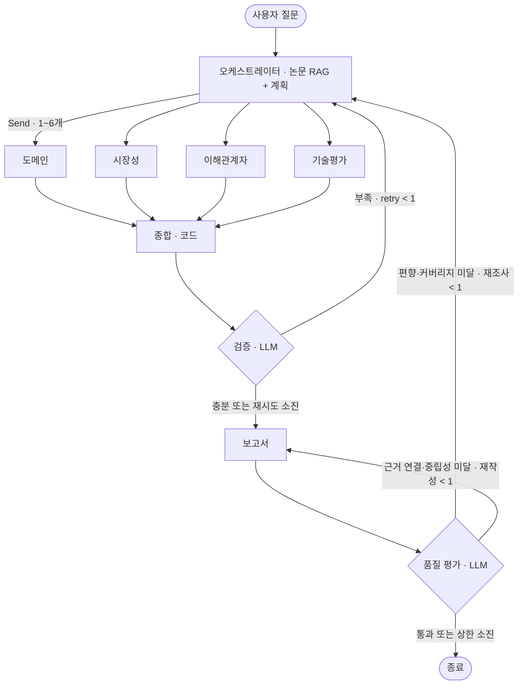

# SKALA Agent — KV Cache 기술 비교

## Subject

장문 LLM 추론에서 KV cache는 context length 증가에 따라 GPU HBM을 빠르게 소모합니다.

본 프로젝트는 이 메모리 병목을 해결하는 두 가지 상반된 접근을 선정하고, **데이터센터·클라우드 서빙 환경에서 기술 성숙도·시장성·이해관계자·도메인 적용성을 근거 기반으로 비교 평가하는 Agentic RAG 시스템**을 구현합니다.

* **SW:** TurboQuant — KV cache 자체를 압축
* **HW:** ITME — 메모리 계층을 확장

목표는 특정 기술의 우열을 결정하는 것이 아니라, **각 접근의 적용 조건과 trade-off를 명확하게 드러내는 것**입니다.

---

## Overview

* **Objective:** KV cache 최적화 기술을 복수 관점에서 중립적으로 비교 평가
* **Domain:** 데이터센터 · 클라우드 LLM Serving
* **Method:** Orchestrator-Workers + Agentic RAG
* **Framework:** LangGraph, LangChain `create_agent`
* **LLM:** GPT-5.4 mini (역할별 reasoning effort)
* **Web Search:** Tavily
* **Embedding:** BAAI/bge-m3

### 핵심 Workflow

```text
사용자 질문
    ↓
오케스트레이터 ── 논문으로 기술 파악 → 필요한 worker와 지시를 동적으로 결정
    ↓ (병렬, 1~6개)
도메인 · 시장성 · 이해관계자 · 기술평가 worker  (검색 최대 3회 + 자기검토 1회)
    ↓
결과 종합 (코드)
    ↓
검증 (LLM) ── 부족 → 부족한 과제만 오케스트레이터가 다시 지시 (1회)
    ↓ 충분
보고서 (LLM 작성 + 코드 인용 검사)
```

---

## Selected Technologies

| 구분 | 기술             | 접근                            |
| -- | -------------- | ----------------------------- |
| SW | **TurboQuant** | KV cache를 저비트 양자화해 저장량 감소     |
| HW | **ITME**       | CXL 기반 계층형 메모리 확장으로 KV 수용량 증가 |

두 기술은 동일한 KV cache 병목을 해결하지만 접근이 정반대입니다.

```text
TurboQuant
→ 데이터를 작게 만든다
→ 정확도 / 압축률 trade-off

ITME
→ 저장 공간을 넓힌다
→ 성능 / 인프라 비용 trade-off
```

비교 대상은 Agent가 아닌 **Human 기반으로 선정**했습니다.
접근의 대립성, 적용 전제, 검증 주기의 차이를 기준으로 선정하여 이후 다관점 평가에 분석의 초점을 맞췄습니다.

---

## Key Features

* 질문에 맞춰 **오케스트레이터가 worker와 지시를 동적으로 계획** (과제 1~6개, 같은 worker 최대 2개)
* worker는 **ReAct 에이전트**로 웹 검색·논문 검색을 스스로 고르고, 검색은 **최대 3회**
* 모든 근거는 도구가 가져온 **원문과 글자 단위로 대조**한 인용만 인정
* worker마다 **자기검토 1회**, 검증 단계가 부족하다고 하면 **부족한 과제만 1회 재시도**
* 보고서 인용은 코드가 검사하고, 통과하지 못하면 **템플릿 보고서로 대체**
* SQLite **Checkpointer**로 중단된 실행을 `--resume`으로 이어서 실행
* `run_id`로 보고서 파일과 **LangSmith 추적**을 연결

### 차별점

> **판정은 LLM이 하되, 경계(계획 규칙·인용 원문 대조·재시도 상한)는 코드가 지킨다.**

자세한 내용은 아래 [Differentiators](#differentiators)에 정리했습니다.

---

## Agents

| Agent | 역할 |
| --- | --- |
| **Orchestrator** | 논문 RAG로 기술 개요를 만들고, 질문에 필요한 하위 과제와 담당 worker를 정함. 재시도 때는 부족한 과제만 다시 지시 |
| **Domain worker** | 데이터센터 비용·SLA(TTFT/TPOT, 정확도)·운영 적합성 |
| **Market worker** | 수요·채택 사례·생태계와 의존성 |
| **Stakeholder worker** | GPU·메모리 벤더, 클라우드, 오픈소스, 투자자 입장 |
| **Tech worker** | 기술 원리·실험 근거·한계·성숙도(TRL) |
| **Synthesizer** | worker 결과를 관점별로 모음 (코드, LLM 없음) |
| **Validator** | 질문에 답하기에 충분한지 판정하고 부족한 과제에 보완점을 지시 |
| **Reporter** | 8개 목차 보고서 작성. 인용·목차는 코드가 검사 |

---

## Agent Model Strategy

모든 Agent가 같은 모델(GPT-5.4 mini)을 쓰고, 역할별로 **추론 강도(reasoning effort)** 만 다르게 둡니다.

| 역할 | Effort | 이유 |
| --- | --- | --- |
| Orchestrator | high | 질문을 하위 과제로 나누는 계획 |
| Worker | medium | 검색어 선택과 근거 추출 |
| Self-review | low | 인용과 주장의 대응 점검 |
| Validator | medium | 충분성 판정과 보완 지시 |
| Reporter | medium | 근거 기반 장문 작성 |

모델 ID는 `OPENAI_MODEL` 환경변수로 바꿀 수 있습니다.

---

## RAG

### Documents

* TurboQuant 원 논문
* TurboQuant 독립 분석 자료
* ITME 원 논문

각 chunk에는 다음 metadata를 저장합니다.

```text
paper_id
camp
role
section
```

### Embedding Selection

후보:

* BAAI/bge-m3
* Qwen3-Embedding-0.6B
* multilingual-e5-large
* gte-multilingual-base

50개 기술 질의로 직접 평가했습니다.

| Model                 |   Hit@1 |   Hit@3 |        MRR |
| --------------------- | ------: | ------: | ---------: |
| **BGE-M3**            | **46%** | **74%** | **0.6127** |
| Qwen3-Embedding-0.6B  |     38% |     68% |     0.5513 |
| multilingual-e5-large |     32% |     58% |     0.5057 |
| gte-multilingual-base |     32% |     56% |     0.4894 |

따라서 **BGE-M3**를 최종 Embedding 모델로 선정했습니다.

---

## Architecture


```mermaid
flowchart TD
    S([사용자 질문]) --> O[오케스트레이터 · 논문 RAG + 계획]
    O -->|Send · 1~6개| W1[도메인]
    O --> W2[시장성]
    O --> W3[이해관계자]
    O --> W4[기술평가]
    W1 --> Y[종합 · 코드]
    W2 --> Y
    W3 --> Y
    W4 --> Y
    Y --> V{검증 · LLM}
    V -->|충분 또는 재시도 소진| R[보고서]
    V -->|부족 · retry < 1| O
    R --> J{품질 평가 · LLM}
    J -->|편향·커버리지 미달 · 재조사 < 1| O
    J -->|근거 연결·중립성 미달 · 재작성 < 1| R
    J -->|통과 또는 상한 소진| E([종료])
```

worker 내부는 `create_agent` ReAct 루프입니다. 도구는 `web_search`(Tavily)와 `paper_search`(bge-m3 색인)이고, `ToolCallLimitMiddleware`가 호출을 3회로 제한합니다. 끝나면 코드가 인용을 원문과 대조하고, LLM 자기검토 1회 뒤 한 번 더 대조합니다.

판정(검증)은 LLM, 다음 경로와 재시도 상한은 `checks.route_after_validate`가 정합니다.

보고서가 나오면 judge가 4개 항목을 통과/미달로 판정합니다: 근거 연결(groundedness), 중립성(neutrality), 편향 통제(bias), 관점 커버리지(coverage). 어디로 되돌릴지는 `checks.judge_action`이 항목별로 정합니다. 서술 문제(근거 연결·중립성)는 보고서 재작성으로, 근거 문제(편향·커버리지)는 오케스트레이터 재조사로 보냅니다. 재조사에서는 계획에 빠진 관점을 새 과제로 추가할 수 있습니다. 재작성과 재조사는 각각 1회까지입니다. 끝까지 미달이면 한계점에 기록하고 종료합니다. 무한 루프는 `recursion_limit=25`로 한 번 더 막습니다.

---

## State Design

노드는 바뀐 키만 반환합니다. 병렬 worker는 자기 `task_id` 키에만 쓰고, dict 병합 Reducer로 합쳐집니다.

```text
run_id          실행 번호 (보고서 파일·LangSmith metadata·체크포인트 thread_id)
question        사용자 질문
tech_brief      오케스트레이터가 논문으로 만든 기술 개요
plan            하위 과제 목록 [{id, agent, instruction}]
worker_results  task_id → {from, success, findings[{claim, source_id, quote}], verdict, error}
sources         source_id → 도구가 가져온 원문 (인용 검사의 기준)
result          관점별로 묶은 worker 결과
verdict         {sufficient, feedback: task_id → 보완점}
retry_count     validate 재시도 횟수 (최대 1)
to_run          이번 회차에 실행할 task_id → 보완 피드백
cited_ids       REFERENCE 번호 순서의 source_id
quality         judge 판정 {checks: 항목 → {passed, reason}, action, error}
rewrite_count   보고서 재작성 횟수 (최대 1)
research_count  judge 재조사 횟수 (최대 1)
node_status     노드·과제별 pending / done / failed
last_error      중단 시 마지막 오류 (재개 안내용)
report          최종 Markdown
```

자세한 계약은 [`docs/interfaces.md`](docs/interfaces.md)에 있습니다.

---

## Differentiators

주제는 모든 조가 같습니다. 저희가 다르게 한 것은 설계에 적어둔 판단을 그대로 믿지 않고
숫자로 확인한 점입니다. 확인하는 과정에서 처음 세웠던 가정이 두 번 틀렸습니다.

### 계약을 먼저 고정하고 시작했다

다섯 명이 동시에 개발해야 했습니다. 보통은 각자 만든 뒤 마지막에 합치는데, 그러면
서로 기대하는 데이터 모양이 달라서 합치는 단계에서 시간을 다 씁니다.

그래서 코드를 쓰기 전에 State key와 Agent의 입출력 형태를 먼저 확정했습니다.
어떤 키를 누가 만들고 누가 읽는지, 병렬로 실행될 때 관점별로 나눌지 합칠지,
재실행하면 기존 결과를 덮을지 남길지를 정해두고 출발했습니다.
그리고 합성 데이터를 fixture로 만들어, 다른 사람 코드가 없어도 각자 자기 모듈을
끝까지 테스트할 수 있게 했습니다. 확정한 계약은 [`docs/interfaces.md`](docs/interfaces.md)에 있습니다.

### 검색 성능을 두 번 측정했다

임베딩으로 bge-m3를 고른 것 자체는 특별하지 않습니다. 다만 고르고 끝내지 않았습니다.

설계 단계에서는 후보 4종을 기술 질의 50문항으로 비교해 모델을 선정했습니다(위 Embedding Selection).
구현을 마친 뒤에는 실제로 만들어진 검색 파이프라인이 의도대로 동작하는지를 다시 확인했습니다.
이번에는 정답을 논문의 어느 청크에 있는지까지 직접 찾아 라벨링한 한국어 질의 20문항을 사용했습니다.

| 조건 | Hit@1 | Hit@3 | MRR |
| --- | ---: | ---: | ---: |
| 전체 청크 | 0.750 | 0.900 | 0.838 |
| References 청크 제외 | 0.750 | 0.850 | 0.812 |

20문항 중 17문항이 1위로 정답을 찾았습니다. 질의는 한국어, 논문은 영어입니다.

| 한국어 질의 | 1위로 나온 청크 | 점수 |
| --- | --- | ---: |
| CXL 기반 계층적 메모리 확장 | `itme-p4-1` (3.1 Architecture and Hardware Design) | 0.648 |
| KV 캐시 양자화가 정확도에 미치는 영향 | `turboquant-p20-1` (정확도 벤치마크 표) | 0.571 |
| 실험 환경과 측정 조건 | `turboquant_analysis-p11-1` (Setup) | 0.522 |

두 측정은 목적이 다릅니다. 앞의 50문항은 어떤 모델을 쓸지 고르기 위한 비교이고,
뒤의 20문항은 고른 모델로 만든 파이프라인을 검증한 것입니다. 수치를 섞어서 읽으면 안 됩니다.
평가셋과 재현 명령은 [`docs/issue-4-retrieval-evaluation.md`](docs/issue-4-retrieval-evaluation.md)에 있습니다.

### 측정 결과가 설계를 두 번 뒤집었다

**참고문헌은 빼는 게 낫다고 봤습니다.** 참고문헌 목록은 키워드는 많지만 근거로 쓸 수 없으니
검색에서 제외하면 정확도가 오를 것이라 판단하고, 참고문헌 청크를 자동으로 찾아내는 기능을
만들었습니다. 빼고 다시 측정하니 Hit@3가 0.900에서 0.850으로 떨어졌습니다.

원인은 한 페이지에 두 가지가 섞여 있었기 때문입니다. `turboquant-p21-1`은 위쪽에 Recall 그래프가
있고 아래쪽에서 참고문헌이 시작되는 페이지입니다. 청킹이 페이지 단위라 그 페이지 전체가
참고문헌으로 분류되었고, 정답이던 그래프가 같이 사라졌습니다.
결국 가정을 버렸습니다. 참고문헌 표시는 메타데이터로만 남기고 검색에서 거르지 않습니다.

**dense 임베딩만으로 충분하다고 봤습니다.** "KV, KQV, QKQV 세 가지 양자화 스킴의 정의"를
묻는 질의가 상위 10개 안에도 들지 못했습니다. 세 약어가 한두 글자만 달라서 구분이 되지 않습니다.
bge-m3를 고른 이유 중 하나가 약어와 고유명사가 많은 문서에 대응하기 위해서였는데,
그 보완이 아직 반영되지 않은 지점이 실측으로 드러났습니다. 다음에 무엇을 붙여야 하는지가
추측이 아니라 숫자로 확인됐습니다.

### 같은 결과가 다시 나오도록 만들었다

측정은 다시 돌렸을 때 같은 값이 나와야 의미가 있습니다. 그래서 네 가지를 고정했습니다.

논문은 `configs/documents.json`에 sha256을 적어 같은 판본인지 확인할 수 있게 했습니다.
청크 ID는 `{paper_id}-p{page}-{순번}` 형식이라 다시 색인해도 번호가 유지됩니다.
색인을 만들 때 쓴 임베딩 모델, 청킹 설정, 청크 수, 차원은 manifest 파일로 남깁니다.
평가셋과 색인의 청킹 버전이 다르면 측정을 시작하지 않고 멈춥니다.
청킹 설정이 바뀌면 정답 청크 번호가 전부 달라지는데, 그걸 모른 채 측정하면 틀린 값이 나오기 때문입니다.

논문 PDF는 저작권 때문에 저장소에 올리지 않습니다. 대신 주소와 sha256을 올려두어
같은 파일을 받아 같은 결과를 재현할 수 있습니다.

---

## Report Highlights

보고서는 어느 기술이 더 낫다는 결론을 내지 않습니다. 같은 병목을 두고 관점에 따라
평가가 어떻게 갈리는지를 보여주는 것이 목적입니다.

| 관점 | TurboQuant (SW) | ITME (HW) |
| --- | --- | --- |
| 운영 | 소프트웨어만 바꾸면 되므로 바로 적용 가능 | CXL 인프라가 먼저 깔려 있어야 함 |
| 서비스 품질 | 압축 과정에서 정확도 손실 위험 | 원본을 그대로 두므로 손실 없음 |
| 도입 장벽 | 낮음 | 높음 |

같은 기술이라도 어느 관점에서 보느냐에 따라 장점이 단점이 됩니다. TurboQuant은 당장
적용할 수 있지만 SLA 위반 위험을 떠안고, ITME는 위험이 없는 대신 인프라 전환이 전제입니다.
그래서 결론은 "이것을 쓰세요"가 아니라 "어느 위험을 감당할 수 있는지에 따라 답이 갈린다"입니다.

이해관계자 관점에서 대립이 가장 분명하게 드러납니다. GPU·가속기 벤더 입장에서는 메모리를
아껴주는 기술이 자사 칩 수요를 줄일 수 있어 반가운 일이 아닙니다. 반대로 메모리 벤더에게는
메모리 확장이 곧 매출입니다. 두 주체의 이해가 정면으로 부딪칩니다.

### 한계를 함께 적었습니다

이 평가는 공개된 정보를 바탕으로 한 추정입니다. 특히 기술 성숙도는 논문이 나온 시점과
실제로 쓰이기 시작하는 시점 사이에 간격이 있어서, 공개 자료만으로는 확인되지 않는 구간이 큽니다.

그래서 모든 판정에 근거 URL과 원문 발췌를 함께 남기고, 검증된 출처가 2건이 안 되면
confidence를 low로 표시합니다. 지지하는 근거를 찾지 못하면 결론을 만들지 않고 판단 보류로
기록합니다. URL이 존재한다는 사실만으로 주장을 확정하지 않고, 그 원문이 실제로 주장을
지지하는지 따로 판정합니다.

---

## Lessons Learned

### 실행해보지 않은 코드는 동작한다고 말할 수 없다

임베딩 연결 코드를 작성하고 테스트 178개를 통과시켰습니다. 실제 모델로 돌리기 전에
라이브러리 소스를 확인했는데, `encode()`에 `max_length`를 넘기지 않으면 512 토큰에서
문장이 잘리는 기본값이 적용되고 있었습니다. 저희가 만든 청크는 최대 1,500 토큰입니다.

그대로 실행했다면 오류 없이 내용의 3분의 2가 버려진 채 결과가 나왔을 것입니다.
함수 이름도 인자도 반환 형식도 전부 맞았고, 틀린 것은 기본값 하나였습니다.
테스트가 모두 통과하더라도 가짜 데이터로만 돌린 것이라면 아무것도 보장하지 못합니다.

### 계산해본 값과 실제로 재본 값은 달랐다

청크가 61개 나올 것이라고 계산했지만 실제 토크나이저로는 69개였습니다.
참고문헌을 제외하면 성능이 오를 것이라 예상했지만 오히려 떨어졌습니다.
두 번 다 예상이 틀렸고, 재봤기 때문에 알 수 있었습니다.

### 계약을 정해두면 병렬 개발은 되지만 통합은 따로 챙겨야 한다

각자 맡은 모듈은 문제없이 굴러갔습니다. 그런데 모듈과 모듈을 연결하는 일은 누구의 담당도
아니어서 계속 뒤로 밀렸습니다. 검색 파이프라인을 완성하고 성능까지 측정한 다음에도
워크플로에는 연결되지 않은 상태로 며칠이 지났습니다. 이슈로 등록하고 담당을 정하고 나서야
해결됐습니다. 다음에는 연결 작업 자체를 하나의 할 일로 두고 담당자와 기한을 붙이려고 합니다.

---

## Directory Structure

```text
├── data/                  # PDF (커밋하지 않음)
├── index/                 # 논문 색인 (커밋하지 않음)
├── src/skala_agent/
│   ├── agents/            # orchestrator · worker · synthesizer · validator · reporter
│   ├── prompts/           # 에이전트별 프롬프트
│   ├── retrieval/         # PDF / 청킹 / 임베딩 / 검색
│   ├── workflow/          # State와 LangGraph 그래프
│   ├── checks.py          # 계획·인용·보고서·분기 규칙 (LLM 없음)
│   ├── tools.py           # web_search · paper_search
│   ├── llm.py             # 역할별 모델
│   └── cli.py             # 실행 진입점
├── outputs/               # report-{run_id}.md, checkpoints.sqlite
└── tests/                 # 단위 테스트 + live 테스트
```

---

## Usage

```bash
make setup
make run                                   # 기본 질문으로 보고서 생성
uv run skala-agent --question "도입 비용 관점에서 비교해줘"
uv run skala-agent --resume <run_id>       # 중단된 실행 이어서
make test                                  # 단위 + live (실제 API 호출)
make test-unit                             # API 없이 규칙만
make lint
```

필요한 외부 API Key(OpenAI, Tavily, 선택: LangSmith)는 `.env`로 관리하며 Repository에는 포함하지 않습니다. 예시는 `.env.example`에 있습니다. 논문 색인은 `uv sync --extra embedding` 후 `uv run skala-index`로 만듭니다.

---

## Contributors

* **김동찬** — PDF Parsing, Chunking, Embedding, VectorStore, Retrieval
* **김강휘** — TRL·Market·Stakeholder·Domain Agent, Prompt, Structured Output
* **윤소영** — State, LangGraph Workflow, Fan-out/Fan-in, Retry Routing
* **이준형** — Synthesis, Evidence Validation, Report/Citation, E2E Test, README

---
